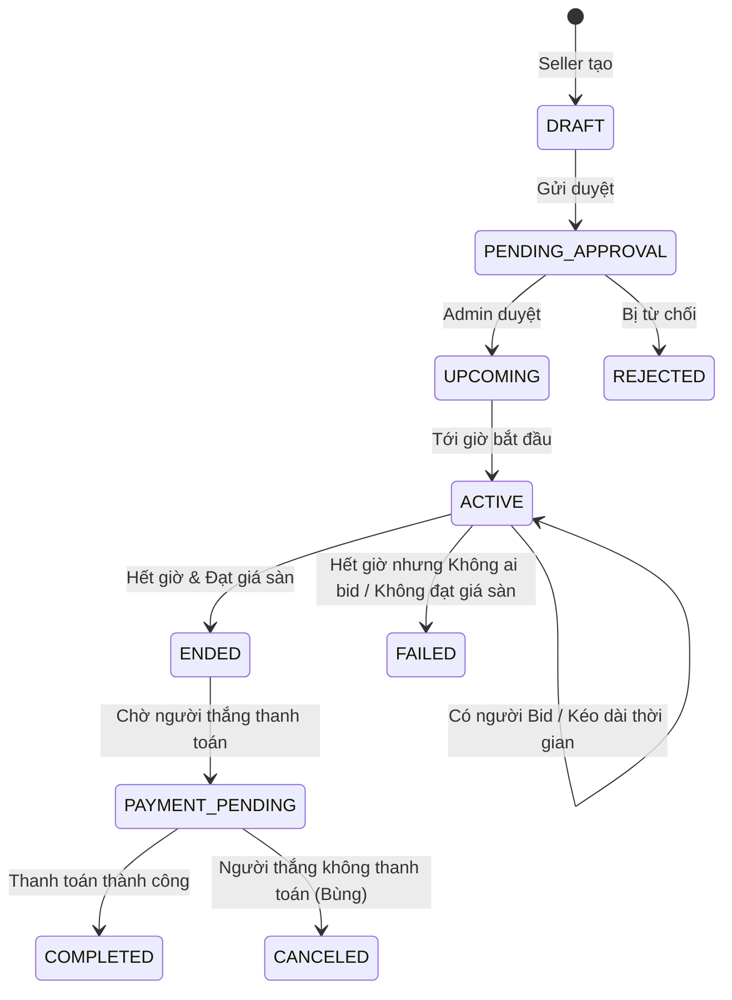

# Thiết kế Chức năng Hệ thống Đấu giá Trực tuyến (Online Bidding System)

Hệ thống đấu giá trực tuyến là một hệ thống phức tạp, đòi hỏi khả năng xử lý đồng thời (concurrency) cao, cập nhật thời gian thực (real-time) và tính nhất quán dữ liệu nghiêm ngặt. Dưới đây là thiết kế các chức năng hoàn chỉnh cho bài tập lớn của bạn.

## 1. Các Vai trò (Actors)
1. **Guest (Khách chưa đăng nhập):** Có thể xem các sản phẩm, phiên đấu giá đang diễn ra nhưng không thể tham gia.
2. **Bidder (Người đấu giá):** Người dùng đã xác thực, có thể nạp tiền cọc, theo dõi và đặt giá sản phẩm.
3. **Seller (Người bán):** Đăng sản phẩm, tạo các phiên đấu giá và quản lý các sản phẩm của mình.
4. **Admin (Quản trị viên):** Kiểm duyệt sản phẩm, xử lý khiếu nại, quản lý tài khoản và cấu hình hệ thống.

---

## 2. Các Module Chức năng (Functional Requirements)

### 2.1. Module Quản lý Người dùng (User Management)
- **Đăng ký & Đăng nhập:** Hỗ trợ đăng nhập truyền thống (Email/Password) và OAuth (Google, Facebook).
- **Xác thực danh tính (KYC):** Yêu cầu tải lên CCCD/CMND hoặc xác thực số điện thoại để tránh tình trạng "bùng" hàng (Ghost Bidding).
- **Quản lý Hồ sơ cá nhân:** Thông tin cá nhân, lịch sử tham gia đấu giá, lịch sử đăng bán.
- **Hệ thống Đánh giá & Phản hồi (Rating/Review):**
  - Người mua đánh giá người bán (chất lượng sản phẩm).
  - Người bán đánh giá người mua (tốc độ thanh toán, uy tín).

### 2.2. Module Quản lý Sản phẩm & Phiên Đấu giá (Auction Management)
- **Đăng sản phẩm (Seller):**
  - Upload hình ảnh, video, mô tả chi tiết, tình trạng sản phẩm.
  - Thiết lập thông số đấu giá:
    - **Starting Price** (Giá khởi điểm).
    - **Bid Increment** (Bước giá - số tiền tối thiểu phải cộng thêm vào giá hiện tại).
    - **Buy-it-now Price** (Giá mua ngay - tùy chọn).
    - **Reserve Price** (Giá sàn tối thiểu để người bán đồng ý bán - ẩn với người mua).
    - Thời gian bắt đầu và kết thúc.
    - Tiền cọc yêu cầu (Deposit Fee) để được tham gia.
- **Duyệt sản phẩm (Admin):** Cấu hình tự động duyệt hoặc duyệt thủ công.
- **Tìm kiếm & Lọc:**
  - Lọc theo danh mục, trạng thái (Đang diễn ra, Sắp kết thúc), khoảng giá.
  - Tìm kiếm full-text (tên sản phẩm).

### 2.3. Module Cốt lõi: Bidding Engine (Xử lý Đấu giá)
Đây là trái tim của hệ thống.
- **Đặt giá thủ công (Manual Bid):** Người dùng nhập mức giá muốn đặt (phải $\ge$ Giá hiện tại + Bước giá).
- **Đấu giá tự động (Proxy Bidding / Auto-bid):** Người dùng nhập mức giá tối đa sẵn sàng trả. Hệ thống sẽ tự động thay mặt họ đặt giá cao hơn đối thủ với khoảng cách đúng bằng 1 "Bước giá", cho đến khi đạt mức giá tối đa.
- **Cập nhật Thời gian thực (Real-time updates):** Sử dụng WebSockets (hoặc Server-Sent Events) để phát (broadcast) giá mới nhất, danh sách người đang đặt giá và thời gian đếm ngược tới tất cả client.
- **Chống "Bắn tỉa" (Anti-Snipping / Soft Close):** Nếu có một lượt đặt giá hợp lệ xảy ra trong X phút cuối (ví dụ 3 phút cuối), hệ thống sẽ tự động cộng thêm Y phút vào thời gian kết thúc để đảm bảo công bằng.
- **Lịch sử đặt giá (Bid History):** Bảng minh bạch hiển thị thời gian, người đặt (có thể ẩn danh 1 phần) và số tiền đã đặt.

### 2.4. Module Thanh toán & Ví điện tử (Payment & Wallet)
- **Ví điện tử nội bộ:** Người dùng nạp tiền vào ví hệ thống thông qua VNPay/Momo/Stripe.
- **Tạm giữ tiền cọc (Hold/Lock Funds):**
  - Khi tham gia một phiên đấu giá, người dùng bị tạm giữ một khoản cọc (ví dụ 10% giá khởi điểm).
  - Kết thúc phiên: Trả lại cọc cho người thua, giữ cọc/trừ tiền trực tiếp với người thắng.
- **Thanh toán Đơn hàng:** Tạo hóa đơn cho người thắng cuộc kèm hạn chót thanh toán. Xử lý phạt (phạt cọc, khóa tài khoản) nếu quá hạn.

### 2.5. Module Thông báo (Notification System)
- **In-app, Push Notification, Email.**
- Các sự kiện kích hoạt:
  - Bị người khác trả giá cao hơn (Outbid alert).
  - Phiên đấu giá đang theo dõi sắp bắt đầu / sắp kết thúc.
  - Chiến thắng phiên đấu giá.
  - Cập nhật trạng thái thanh toán và giao hàng.

---

## 3. Yêu cầu Phi chức năng (Non-Functional Requirements - Điểm cộng lớn)
Để bài tập lớn có điểm xuất sắc ở môn Kiến trúc phần mềm, bạn cần chú trọng các vấn đề sau:
1. **Concurrency (Tính đồng thời):** Xử lý hiện tượng *Race Condition*. Ví dụ: Khi sản phẩm có giá 100k, bước giá 10k. Hai người A và B cùng ấn đặt 110k cùng một thời điểm. Cần dùng Database Lock (Optimistic/Pessimistic) hoặc Redis/Lua Scripting để đảm bảo chỉ có 1 người thành công và người kia bị từ chối.
2. **Tính thời gian thực (Real-time):** Đảm bảo độ trễ thấp để luồng giá hiển thị nhanh nhất.
3. **Cron Jobs / Background Tasks:** Xử lý tự động đóng phiên đấu giá khi thời gian chạy về 0 (ví dụ dùng RabbitMQ/Kafka delay queues hoặc Redis Expiry, cron scheduler).

---

## 4. Sơ đồ Trạng thái Phiên Đấu giá (State Machine)

## 5. Sơ đồ Kiến trúc Đề xuất (Microservices/Modular Monolith)

Nếu bạn làm theo kiến trúc Microservices, đây là sự phân chia hợp lý:
1. **API Gateway:** Điều hướng request, xác thực JWT.
2. **User Service:** Quản lý User, KYC, Auth.
3. **Auction Catalog Service:** CRUD thông tin sản phẩm, quản lý phiên đấu giá, Elasticsearch để tìm kiếm.
4. **Bidding Engine Service:** Xử lý nghiệp vụ đặt giá, Queue xử lý tuần tự, WebSockets bắn ra client.
5. **Payment Service:** Quản lý ví, gọi API ngân hàng.
6. **Notification Service:** Xử lý gửi mail, SMS, push.

*(Lưu ý: Nếu nhóm ít người, nên làm **Modular Monolith** thay vì Microservices để tiết kiệm thời gian deployment).*

---

## 6. Tech Stack Đề Xuất (Dành cho nền tảng Web)

Đối với một hệ thống đấu giá trực tuyến, thách thức lớn nhất là **xử lý đồng thời (concurrency)**, **thời gian thực (real-time)**, và **tính nhất quán (ACID)**. Do đó, việc lựa chọn công nghệ cần dựa trên việc giải quyết các bài toán này. Dưới đây là 2 bộ Tech Stack tối ưu nhất cho bài tập lớn:

### Lựa chọn 1: Stack Hiện đại & Đồng bộ (Khuyên dùng)
Bộ này sử dụng hoàn toàn TypeScript/JavaScript cho cả Frontend và Backend, giúp bạn tái sử dụng code (types/interfaces) và phát triển rất nhanh.
* **Frontend:** **Next.js (React)** kết hợp với **TailwindCSS**. 
  * *Lý do:* Next.js hỗ trợ Server-Side Rendering (SSR) giúp SEO tốt cho trang chi tiết sản phẩm đấu giá. React xử lý các state thay đổi liên tục (giá thầu, đếm ngược) rất mượt.
* **Backend:** **NestJS (Node.js/TypeScript)**.
  * *Lý do:* Cấu trúc thư mục chuẩn mực (rất ghi điểm môn Kiến trúc phần mềm), hỗ trợ Dependency Injection tuyệt vời, tích hợp sẵn module WebSockets (`Socket.io`) cực kỳ mạnh mẽ để broadcast giá realtime.
* **Cơ sở dữ liệu (Database):** **PostgreSQL**.
  * *Lý do:* Hỗ trợ ACID tốt nhất, tính toàn vẹn dữ liệu tài chính cao (tránh mất tiền/lệch giá).
* **Caching & Locking (BẮT BUỘC):** **Redis**.
  * *Lý do:* Dùng để cache giá hiện tại (giảm tải cho Database), dùng làm **Distributed Lock** để ngăn chặn 2 người cùng đặt 1 giá tại cùng 1 mili-giây, và làm hệ thống Pub/Sub cho WebSockets.
* **Background Jobs (Hàng đợi):** **BullMQ** (chạy trên nền Redis).
  * *Lý do:* Dùng để lên lịch (schedule) đóng phiên đấu giá một cách chính xác khi hết giờ, hoặc xử lý gửi Email/Thông báo bất đồng bộ.

### Lựa chọn 2: Stack Doanh nghiệp (Enterprise)
Nếu môn học yêu cầu chặt chẽ về hướng đối tượng (OOP) hoặc các pattern truyền thống:
* **Frontend:** **React (Vite)** hoặc **Angular**.
* **Backend:** **Java Spring Boot** hoặc **C# .NET Core**.
  * *Lý do:* Khả năng xử lý Multi-threading siêu việt, dễ dàng cài đặt các Lock (Pessimistic/Optimistic Locking) ở tầng Database thông qua Hibernate/Entity Framework. Phù hợp nhất với mô hình Microservices.
* **Database & Caching:** Tương tự Lựa chọn 1 (PostgreSQL & Redis).
* **Message Broker:** **RabbitMQ** hoặc **Apache Kafka** (để quản lý luồng dữ liệu đấu giá lớn).

### 💡 Lời khuyên thiết kế cho Bài tập lớn:
1. **Phần quan trọng nhất cần thiết kế kỹ:** Chức năng gửi lệnh Bid (Đặt giá). Bạn nên vẽ biểu đồ tuần tự (Sequence Diagram) chứng minh luồng: `Client -> API -> Redis Lock (kiểm tra giá trị và chặn trùng lặp) -> Save to Database -> Broadcast WebSockets cho các Client khác`.
2. **Đừng quên dùng Transaction:** Trong database, khi tạo lệnh Bid và trừ tiền cọc, phải đưa vào chung 1 Transaction. Nếu 1 cái thất bại thì rollback toàn bộ.
